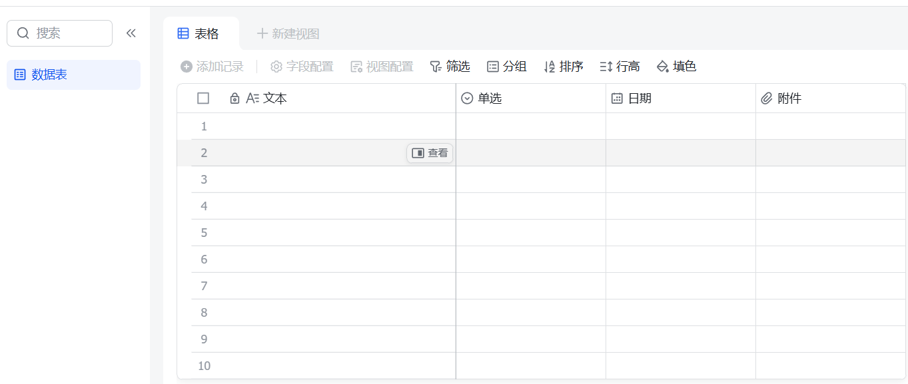

# FeedBack-Backend

# 📝 飞书 OAuth 接口使用说明

## 📌 简介

本系统使用飞书 OAuth 实现用户认证。首次部署需完成授权流程并调用初始化接口，之后系统会自动刷新 token，前端可直接从 `/get_token` 获取 `access_token` 并用于后续接口调用。

---

## 🚀 首次部署流程（管理员必做）

> ⚠️ 必须先完成此步骤，后续 token 才能自动刷新。

1. 打开浏览器访问：
   ```
   http://localhost:8080
   ```
2. 点击页面上的“使用飞书登录”按钮。
3. 成功授权后，系统将自动调用 `/callback` 接口，获取 `access_token` 与 `refresh_token`。
4. 授权成功后，从响应中获取 `access_token` 和 `refresh_token`。
5. 调用初始化接口 `/init_token`，后台启动自动刷新机制。

### 初始化接口调用示例：

- **接口地址**：`POST /init_token`
- **请求体**：
```json
{
  "access_token": "your_access_token",
  "refresh_token": "your_refresh_token"
}
```
- **响应数据**：
```json
{
  "code": 0,
  "message": "Success",
  "data": null
}
```

---

## 🔁 后续调用流程（推荐前端使用）

### Step ✅ - 调用 `/get_token` 获取当前 `access_token`

- **接口地址**：`POST /get_token`
- **请求体**：
```json
{
    "table_id":"xxx",
    "normal_table_id":"xxx"
}
```
其中`table_id`为反馈问题表格ID，`normal_table_id`为常见问题表格ID。
- **响应数据**：
```json
{
  "code": 0,
  "message": "Success",
  "data": {
    "access_token": "current_access_token"
  }
}
```

---

## 📦 示例：前端调用业务接口流程

```ts
async function prepareAuthHeaders() {
  const res = await fetch('/get_token', {
    method: 'POST',
  });
  const { access_token } = await res.json().data;

  return {
    Authorization: `Bearer ${access_token}`,
  };
}

const headers = await prepareAuthHeaders();
fetch('/sheet/createapp', {
  method: 'POST',
  headers,
  body: JSON.stringify({ ... }),
});
```

---

## 🔐 所有业务接口需携带 Authorization 头

- 示例：
```http
POST /sheet/createapp
Authorization: Bearer xxxx
```

---

## ✅ 已支持的接口列表（需带 JWT）

| 接口路径                     | 说明              |
|--------------------------|-----------------|
| `POST /sheet/createapp`  | 创建多维表格          |
| `POST /sheet/copyapp`    | 从模板复制表格         |
| `POST /sheet/createrecord` | 添加记录到表格         |
| `POST /sheet/getrecord`  | 获取表格记录          |
| `POST /sheet/getphotourl` | 获取表格记录中的图片链接    |

---

## 🔗 项目模型

https://mastergo.com/file/155789867120318?fileOpenFrom=home&page_id=M&shareId=155789867120318

---
## 📚 完整使用实例

> 💡 **Tips**: 以下所有接口都需要携带 `Authorization` 头进行认证

------

> 💡 **Tips**: 获取`app_token`和`tabel_id`和`view_id`
> 
> 其中红色框内为`app_token`，`table_id`和`view_id`即链接上的黄色框内和棕色框内的内容。
> 

### 1. 🆕 创建多维表格

**接口路径**: `POST /sheet/createapp`

**📋 请求参数**:

```text 
{
    "folder_token": "",  // 📁 文件夹标识，为空时创建在云空间根目录
    "name": "test"       // 📝 多维表格名称
}
```

**✅ 响应结果**:

```text
{
    "code": 0,
    "msg": "Success",
    "data": {
        "app": {
            "app_token": "KIInbGuLraO5dZsvoCdcQBAOnsy",        // 🔑 表格唯一标识
            "name": "test",                                   // 📝 表格名称
            "folder_token": "",                               // 📁 归属文件夹
            "url": "https://vcnay0rphntt.feishu.cn/base/...", // 🔗 表格访问链接
            "default_table_id": "tblji3vkq90Br2kP"          // 📊 默认数据表ID
        }
    }
}
```

**🎯 功能说明**: 创建一个新的多维表格，系统会自动附带创建一个默认数据表。



------

### 2. 📋 从模版复制表格

**接口路径**: `POST /sheet/copyapp`

**📋 请求参数**:

```text
{
    "app_token": "your_app_token",     // 🎯 源表格标识（要复制的表格）
    "folder_token": "",                // 📁 目标文件夹，为空时创建在根目录
    "name": "test",                    // 📝 新表格名称
    "time_zone": "Asia/Shanghai",      // 🌍 文档时区
    "without_content": true            // 🚫 是否不复制内容（true=仅结构，false=含内容）
}
```

**✅ 响应结果**:

```text
{
    "code": 0,
    "msg": "Success",
    "data": {
        "app": {
            "app_token": "HfHbbixFjaMtEvsnkGscSvlvnAh",        // 🔑 新表格唯一标识
            "name": "test",                                   // 📝 新表格名称
            "folder_token": "",                               // 📁 归属文件夹
            "url": "https://vcnay0rphntt.feishu.cn/base/...", // 🔗 新表格访问链接
            "default_table_id": "",                           // 📊 默认数据表ID
            "time_zone": "Asia/Shanghai"                      // 🌍 时区设置
        }
    }
}
```

**🎯 功能说明**: 基于现有表格创建副本，可选择复制结构或完整内容。

> ⚠️ **注意**: 当源表格记录数超过 50,000 条时，仅能复制表格结构。

------

### 3. ➕ 添加记录到表格

**接口路径**: `POST /sheet/createrecord`

**📋 请求参数**:

```text
{
    "student_id": "1",                          // 👤 用户ID
    "contact": "xxx@qq.com",                    // 📧 联系方式
    "content": "test",                          // 💬 反馈内容
    "screen_shot": [                            // 📸 截图附件
        {
            "file_token": "your_file_token"
        }
    ],
    "problem_type": "test",                     // 🏷️ 问题类型
    "problem_source": "test",                   // 📍 问题来源
    "ignore_consistency_check": true            // ✅ 是否忽略数据一致性检查
}
```

**✅ 响应结果**:

```text
{
    "code": 0,
    "msg": "Success",
    "data": {
        "record": {
            "record_id": "recuSiLkCc70QI",      // 🆔 记录唯一标识
            "fields": {
                "用户ID": "1",                   // 👤 用户标识
                "反馈内容": "test",              // 💬 用户反馈
                "截图": [                        // 📸 截图文件
                    {
                        "file_token": "TyxibGfV1obLvIxhvYncpxdfnyf"
                    }
                ],
                "联系方式（QQ/邮箱）": "xxx@qq.com", // 📧 联系信息
                "问题类型": "test",              // 🏷️ 分类标签
                "问题来源": "test",              // 📍 来源渠道
                "问题状态": "处理中",            // 🔄 当前状态
                "提交时间": 1753755493           // ⏰ 创建时间戳
            }
        }
    }
}
```

**🎯 功能说明**: 向指定表格添加新的反馈记录，支持文本、附件等多种字段类型。

**📝 字段映射说明**:

- 字段定义位于 `/api/request/sheet.go` 中的 `CreateAppTableRecordReq` 结构体
- 通过 `feishu` 标签进行中英文字段映射
- 如需自定义字段，请修改对应结构体和标签


**📊 添加结果展示**: 

> 💡 **Tips**: 在添加图片附件的时候，需要前端首先将图片上传到飞书云平台上，获得`file_token`，再交给后端进行添加记录。


------

### 4. 🔍 获取表格记录

**接口路径**: `POST /sheet/getrecord`

**📋 请求参数**:

```text
{
    "field_names": [                    // 📋 要查询的字段列表
        "用户ID",
        "反馈内容", 
        "截图",
        "问题类型",
        "问题来源",
        "联系方式（QQ/邮箱）",
        "提交时间",
        "问题状态",
        "关联需求"
    ],
    "filter_name": "用户ID",            // 🔎 过滤字段名
    "filter_val": "1",                  // 🎯 过滤值
    "sort_orders": "提交时间",          // 📈 排序字段
    "desc": true,                       // ⬇️ 是否降序排列
    "pagetoken": ""                     // 📄 分页标记（首次请求为空）
}
```

**✅ 响应结果**:

```text
{
    "code": 0,
    "msg": "Success",
    "data": {
        "total": 1,                     // 📊 总记录数
        "has_more": false,              // 📄 是否有更多数据
        "items": [                      // 📋 记录列表
            {
                "record_id": "recuSk1VpHLuvc",  // 🆔 记录ID
                "fields": {
                    "用户ID": [                  // 👤 用户标识
                        {
                            "type": "text",
                            "text": "1"
                        }
                    ],
                    "反馈内容": [                // 💬 反馈文本
                        {
                            "type": "text",
                            "text": "test"
                        }
                    ],
                    "截图": [                    // 📸 图片附件
                        {
                            "file_token": "TyxibGfV1obLvIxhvYncpxdfnyf",
                            "name": "demo01.png",
                            "type": "image/png",
                            "size": 1508897,
                            "url": "https://open.feishu.cn/open-apis/drive/v1/medias/TyxibGfV1obLvIxhvYncpxdfnyf/download",
                            "tmp_url": "https://open.feishu.cn/open-apis/drive/v1/medias/batch_get_tmp_download_url?file_tokens=TyxibGfV1obLvIxhvYncpxdfnyf"
                        }
                    ],
                    "联系方式（QQ/邮箱）": [        // 📧 联系信息
                        {
                            "type": "text", 
                            "text": "xxx@qq.com"
                        }
                    ],
                    "问题类型": "test",          // 🏷️ 问题分类
                    "问题来源": "test",          // 📍 来源渠道
                    "问题状态": "处理中",        // 🔄 处理状态
                    "提交时间": 1753774223913    // ⏰ 提交时间戳
                }
            }
        ]
    }
}
```

**🎯 功能说明**: 根据条件查询表格记录，支持字段筛选、排序和分页。

**🔍 查询特性**:

- **字段选择**: 可指定返回特定字段
- **条件过滤**: 支持单字段精确匹配（如需多字段过滤，请自行扩展代码）
- **排序功能**: 支持按指定字段升序/降序排列
- **分页支持**: 通过 `pagetoken` 实现分页查询

------

### 5. 🖼️ 获取表格记录图片链接

**接口路径**: `POST /sheet/getphotourl`

**📋 请求参数**:

```text
{
    "file_tokens": [                    // 📸 图片文件标识列表
        "TyxibGfV1obLvIxhvYncpxdfnyf"
    ]
}
```

**✅ 响应结果**:

```text
{
    "code": 0,
    "msg": "Success", 
    "data": {
        "tmp_download_urls": [          // 🔗 临时下载链接列表
            {
                "file_token": "TyxibGfV1obLvIxhvYncpxdfnyf",
                "tmp_download_url": "https://internal-api-drive-stream.feishu.cn/space/api/box/stream/download/authcode/?code=..."
            }
        ]
    }
}
```

**🎯 功能说明**: 批量获取图片文件的临时访问链接，用于前端页面渲染。

**⏰ 使用注意**:

- 返回的 `tmp_download_url` 为临时链接，有效期为24小时
- 前端可直接使用该链接进行图片展示
- 建议及时使用，避免链接过期

---


## 🛠️ TODO

1. 飞书卡片通知
