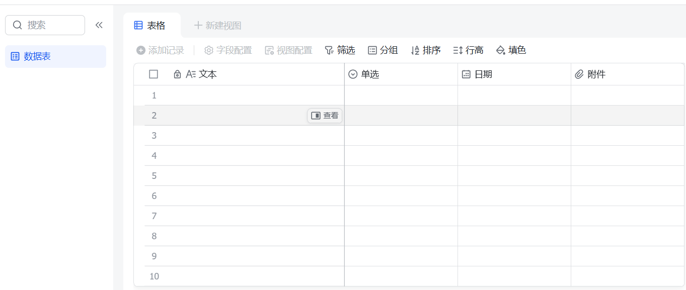
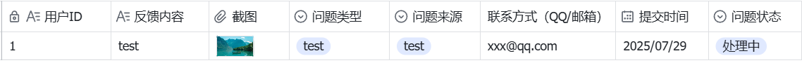

# FeedBack-Backend

# 📝 飞书 OAuth 接口使用说明

## 📌 简介

本系统使用飞书 OAuth 实现用户认证。首次部署需完成授权流程并调用初始化接口，之后系统会自动刷新 token，前端可直接从 `/get_token` 获取 `access_token` 并用于后续接口调用。

---

## 🚀 首次部署流程（管理员必做）

> ⚠️ 必须先完成此步骤，后续 token 才能自动刷新。

1. 打开浏览器访问：
   ```
   http://localhost:8080
   ```
2. 点击页面上的“使用飞书登录”按钮。
3. 成功授权后，系统将自动调用 `/callback` 接口，获取 `access_token` 与 `refresh_token`。
4. 授权成功后，从响应中获取 `access_token` 和 `refresh_token`。
5. 调用初始化接口 `/init_token`，后台启动自动刷新机制。

### 初始化接口调用示例：

- **接口地址**：`POST /init_token`
- **请求体**：
```json
{
  "access_token": "your_access_token",
  "refresh_token": "your_refresh_token"
}
```
- **响应数据**：
```json
{
  "code": 0,
  "message": "Success",
  "data": null
}
```

---

## 🔁 后续调用流程（推荐前端使用）

### Step ✅ - 调用 `/get_token` 获取当前 `access_token`

- **接口地址**：`POST /get_token`
- **响应数据**：
```json
{
  "code": 0,
  "message": "Success",
  "data": {
    "access_token": "current_access_token"
  }
}
```

---

## 📦 示例：前端调用业务接口流程

```ts
async function prepareAuthHeaders() {
  const res = await fetch('/get_token', {
    method: 'POST',
  });
  const { access_token } = await res.json().data;

  return {
    Authorization: `Bearer ${access_token}`,
  };
}

const headers = await prepareAuthHeaders();
fetch('/sheet/createapp', {
  method: 'POST',
  headers,
  body: JSON.stringify({ ... }),
});
```

---

## 🔐 所有业务接口需携带 Authorization 头

- 示例：
```http
POST /sheet/createapp
Authorization: Bearer xxxx
```

---

## ✅ 已支持的接口列表（需带 JWT）

| 接口路径                       | 说明              |
|----------------------------|-----------------|
| `POST /sheet/createapp`    | 创建多维表格          |
| `POST /sheet/copyapp`      | 从模板复制表格         |
| `POST /sheet/createrecord` | 添加记录到表格         |
| `POST /sheet/getrecored`   | 获取表格记录          |
| `POST /sheet/getphotourl`  | 获取表格记录中的图片链接    |

---

## 🔗 项目模型

https://mastergo.com/file/155789867120318?fileOpenFrom=home&page_id=M&shareId=155789867120318

---
## 完整使用实例
> Tips: 这里仅展示各个接口使用示例，都需要携带Authorization头

### 1. 创建多维表格
接口路径：`POST /sheet/createapp`

请求体：
```json
{
    "folder_token": "",
    "name": "test"
}
```
其中`name`是多维表格的名称，`folder_token`是多维表格的归属文件夹，为空时表示多维表格将被创建云空间跟目录下。

响应体：
```json
{
    "code": 0,
    "msg": "Success",
    "data": {
        "app": {
            "app_token": "KIInbGuLraO5dZsvoCdcQBAOnsy",
            "name": "test",
            "folder_token": "",
            "url": "https://vcnay0rphntt.feishu.cn/base/KIInbGuLraO5dZsvoCdcQBAOnsyy",
            "default_table_id": "tblji3vkq90Br2kP"
        }
    }
}
```
其中`app_token`是多维表格的唯一标识符，
`name`是多维表格的名称
`folder_token`是多维表格App归属文件夹，
`url`是多维表格App的URL链接，
`default_table_id`是多维表格默认数据表的ID。

该接口的作用是创建一个多维表格，其附带创建了一个默认数据表。


### 2. 从模版复制表格
接口路径：`POST /sheet/copyapp`

请求体：
```json
{
    "app_token": "your_app_token",
    "folder_token": "",
    "name": "test",
    "time_zone": "Asia/Shanghai",
    "without_content": true  
}
```
其中`app_token`是要复制的多维表格的唯一标识，`folder_token`是多维表格的归属文件夹，为空时表示多维表格将被创建云空间跟目录下。
`name`是多维表格的名称，`without_content`表示是否复制表格内容，true表示不复制，false表示复制。`time_zone`是文档时区。

> Tips: 当多维表格记录数超50000条可复制上限时，仅可复制多维表格结构。

响应体：
```json
{
    "code": 0,
    "msg": "Success",
    "data": {
        "app": {
            "app_token": "HfHbbixFjaMtEvsnkGscSvlvnAh",
            "name": "test",
            "folder_token": "",
            "url": "https://vcnay0rphntt.feishu.cn/base/HfHbbixFjaMtEvsnkGscSvlvnAhh",
            "default_table_id": "",
            "time_zone": "Asia/Shanghai"
        }
    }
}
```
响应体的内容不再陈述。

该接口作用是复制一个多维表格（复制内容或结构），并返回新的多维表格。


### 3. 添加记录到表格
接口路径：`POST /sheet/createrecord`

请求体：
```json
{
    "app_token": "your_app_token",
    "student_id":"1",
    "contact":"xxx@qq.com",
    "content":"test",
    "screen_shot" : [
        {
            "file_token":"your_file_token"
        }
    ],
    "problem_type":"test",
    "problem_source":"test",
    "ignore_consistency_check": true,
    "table_id": "your_table_id"
}
```
其中`tabel_id`是多维表格的唯一标识，而`ignore_consistency_check`表示是否忽略数据一致性检查，true表示忽略，false表示不忽略。
而`student_id`、`contact`、`content`、`screen_shot`···是多维表格的记录字段，
这里因为不想出现中英文互用的key，所以将相应表格的字段封装成结构体`/api/request/sheet.go`中的`CreateAppTableRecordReq`，并由`feishu`标签和反射进行映射。
这里的表格字段如下

如果需要自定义表格字段，请自行修改结构体，并修改`feishu`标签的内容。

响应体：
```json
{
    "code": 0,
    "msg": "Success",
    "data": {
        "record": {
            "fields": {
                "反馈内容": "test",
                "截图": [
                    {
                        "file_token": "TyxibGfV1obLvIxhvYncpxdfnyf"
                    }
                ],
                "提交时间": 1753755493,
                "用户ID": "1",
                "联系方式（QQ/邮箱）": "xxx@qq.com",
                "问题来源": "test",
                "问题状态": "处理中",
                "问题类型": "test"
            },
            "record_id": "recuSiLkCc70QI"
        }
    }
}
```
响应结果如下：


### 4. 获取表格记录
接口路径：`POST /sheet/getrecored`

请求体:
```json
{
    "app_token": "your_app_token",
    "desc": true,
    "field_names": [
        "用户ID",
        "反馈内容",
        "截图",
        "问题类型",
        "问题来源",
        "联系方式（QQ/邮箱）",
        "提交时间",
        "问题状态",
        "关联需求"
    ],
    "filter_name": "用户ID",
    "filter_val": "1",
    "pagetoken": "",
    "sort_orders": "提交时间",
    "table_id": "your_table_id",
    "view_id": "your_view_id"
}
```
其中`field_names`是所查询的字段表格的名称，`filter_name`是过滤的字段名称，`filter_val`是过滤的字段值，`sort_orders`是排序的字段名称，`table_id`是多维表格的唯一标识符，`view_id`是多维表格的视图唯一标识符。
`pagetoken`是分页的标识符，第一次请求时为空，后续请求时为上一次请求的返回值。

> Tips: 这里的`filter_name`和`filter_val`是过滤的内容，因为业务原因，这里只设置了一个过滤字段。如需多个过滤字段，请自行修改代码。

响应体：
```json
{
    "code": 0,
    "msg": "Success",
    "data": {
        "items": [
            {
                "fields": {
                    "反馈内容": [
                        {
                            "text": "test",
                            "type": "text"
                        }
                    ],
                    "截图": [
                        {
                            "file_token": "TyxibGfV1obLvIxhvYncpxdfnyf",
                            "name": "demo01.png",
                            "size": 1508897,
                            "tmp_url": "https://open.feishu.cn/open-apis/drive/v1/medias/batch_get_tmp_download_url?file_tokens=TyxibGfV1obLvIxhvYncpxdfnyf",
                            "type": "image/png",
                            "url": "https://open.feishu.cn/open-apis/drive/v1/medias/TyxibGfV1obLvIxhvYncpxdfnyf/download"
                        }
                    ],
                    "提交时间": 1753774223913,
                    "用户ID": [
                        {
                            "text": "1",
                            "type": "text"
                        }
                    ],
                    "联系方式（QQ/邮箱）": [
                        {
                            "text": "xxx@qq.com",
                            "type": "text"
                        }
                    ],
                    "问题来源": "test",
                    "问题状态": "处理中",
                    "问题类型": "test"
                },
                "record_id": "recuSk1VpHLuvc"
            }
        ],
        "has_more": false,
        "total": 1
    }
}
```
其中`items`是表格记录，`fields`是表格记录的字段，`record_id`是记录ID。
`has_more`表示是否有更多记录，当为true时，会同时返回`pagetoken`分页标记。`total`表示总记录数。


### 5. 获取表格记录图片链接
接口路径：`POST /sheet/getphotourl`

请求体：
```json
{
    "file_tokens": [
        "TyxibGfV1obLvIxhvYncpxdfnyf"
    ]
}
```

`field_tokens`是图片的标识符。

响应体：
```json
{
    "code": 0,
    "msg": "Success",
    "data": {
        "tmp_download_urls": [
            {
                "file_token": "TyxibGfV1obLvIxhvYncpxdfnyf",
                "tmp_download_url": "https://internal-api-drive-stream.feishu.cn/space/api/box/stream/download/authcode/?code=MTRkZjU4ZDM0NGE1ODZjNDhkYzVhM2U1ZTU1ZDlmNWRfYjdmMzBiYjNiMTFlYzk2MmY5NGE0MzMyYWY4NTVlODhfSUQ6NzUyOTc5ODUwNDM4MjAyMTYzM18xNzUzNzU3ODk5OjE3NTM4NDQyOTlfVjM"
            }
        ]
    }
}
```
此时获得的`tmp_download_url`是图片的临时下载链接，前端可以通过该链接进行渲染页面。

---

## 🛠️ TODO

1. 优化 token
